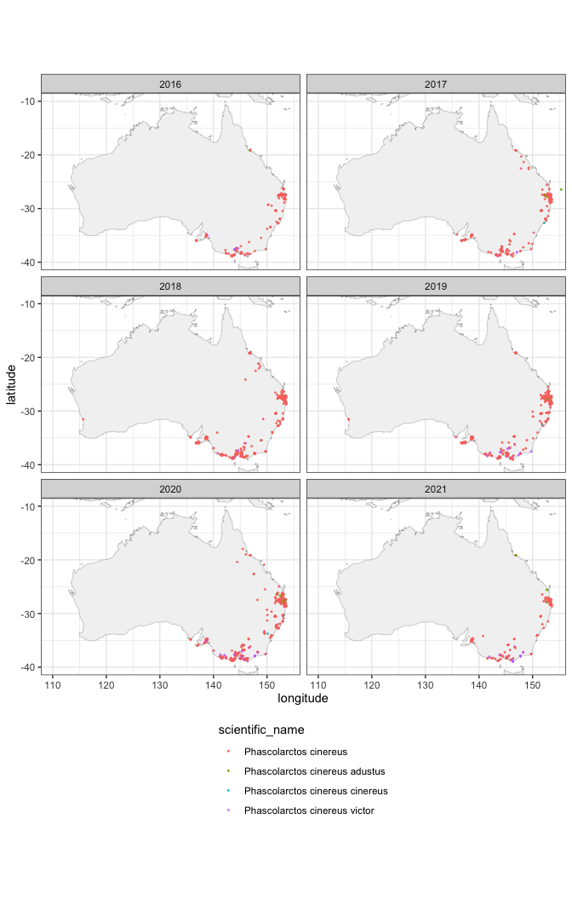

> ## The Decline of Koala Populations in Australia

Presentation ID: 4916

Brittney Nelsen and Chris Merkord

Biosciences Department, Minnesota State University Moorhead, 1104 7th
Avenue South, Moorhead, MN 56563 USA

Presented at the MSUM 23rd Online Student Acadmic Conference

Submit a survey for this presentation:
<https://mnstate.co1.qualtrics.com/jfe/form/SV_eFMAwF72JZIoeSq>

> ### Abstract

Over the years koala populations have been decreasing, this led them to
be listed as a threatened species. Due to the recent brush fires that
happened in Australia in 2020, news articles have stated that koalas
could be facing extinction in New South Wales Australia by the year
2050. But the questions are, how much have the koala species declined
over the past five years? Is there a change of location? and what are
the reasons on why the koalas left the original location. I will be
using data called Rinat to help me answer these questions. I plan on
using this data to show how much the population has decreased. I will
also use this data locate where koala populations have occurred on a map
and to see if there was a change in location due to factors affecting
the koala population. I plan to use exploratory data analysis to search
for my answers by visualizing, transforming, and modeling the data. My
hypothesis is that there will be a change of location due to factors
such as brush fires. This will help me understand why they left that
location and how I can help raise awareness to slow the decline of koala
populations.

> ### Introduction

Koalas are marsupials that are found in forests along the southeastern
and eastern parts of Australia. This continent is know for having
massive bush fires like the fires in 2020. Fires have a devastating
impact of an animal population, such as koalas. This species has a
declining population due to environmental and human factors. This
project will help visualize the decrease or movement of different koala
populations. Seeing how the koala populations have declined or moved can
help determine some factors on why they are doing so.

> ### Methods

#### Data Acquisition

-   I pulled koala data from the github website that allowed me to
    access the iNaturalist data with R for free (Vijay Barve and Edmund
    Hart, 2021). I used this data to show the locations of observed
    koalas in the eastern portion of Australia.

#### Data Preparation

-   I used the rinat package to retrieve the koala observations

-   I did a fuzzy search for observations that would occur in Queensland
    Australia

-   I did a taxon search to return records of Phascolarctos cinereus,
    Phascolarctos cinereus victor, Phascolarctos cinereus adustus,
    Phascolarctos cinereus cinereus

-   I cleaned the data by filtering the data from the years after 2015

-   I mapped koala data location from 2016 to current (H. Wickman, 2016)

-   I made the maps look clean by setting an x and y limitation to show
    Australia rather than the whole world

> ### Results

<!-- -->

Figure 1: observations of different koala species in eastern half of
Australia from 2016 to current.

> ### Discussion

The results showed that there could have been some movement or decline
in the koala populations. One of the most recent bush fires happened
between the end of 2019 and beginning of 2020. Comparing the 2019 and
2020 maps, there were more observations found towards the northeastern
portions and inland portions of Australia. Most of the fires did happen
along the coasts, this might indicate a pattern of relocation. The 2016
and 2017 maps show that most observations occurred in the south. This
could indicate that koalas moved south overtime due to logging that
occurs in Queensland, Australia. If the data had gone back further, it
could have indicated that relocation was due to logging. Even though
that it is hard to tell the difference between the maps, I do believe
that koala populations moved overtime due to fires, deforestation, and
other contributing factors. Knowing where they moved could indicate why
they moved.

> ### Literature Cited

-   I used R version 4.0.3 (2020-10-10)
-   RStudio Team (2020). RStudio: Integrated Development Environment
    for R. RStudio, PBC, Boston, MA URL <http://www.rstudio.com/>.
-   Vijay Barve and Edmund Hart (2021). rinat: Access ‘iNaturalist’ Data
    Through APIs. <https://docs.ropensci.org/rinat/> (website)
    <https://github.com/ropensci/rinat> (devel).
-   H. Wickham. ggplot2: Elegant Graphics for Data Analysis.
    Springer-Verlag New York,
